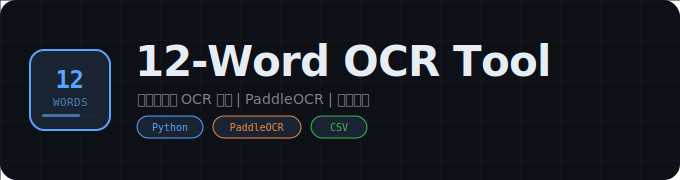

<div align="center">
  

  # 12-Word OCR Tool

  **助记词图片 OCR 批量识别工具**

  [](https://python.org)
  [](https://github.com/PaddlePaddle/PaddleOCR)
  []()
</div>

---

## 概述

基于 PaddleOCR 引擎的助记词图片批量识别工具。自动扫描图片中的 12 个英文单词，按网格布局排序，支持列优先/行优先排列，并将结果导出为 CSV 文件。

## 功能特性

- **PaddleOCR 引擎** -- 高精度英文文本识别，支持自定义英文模型
- **智能网格排序** -- 自动检测 3x4 网格布局，支持列优先和行优先两种排列方式
- **批量处理** -- 自动扫描 `image` 目录下所有图片文件
- **过滤机制** -- 自动过滤数字、中文字符和低置信度结果
- **CSV 导出** -- 识别结果自动保存为带时间戳的 CSV 文件

## 项目结构

```
12单词ocr/
├── mian/
│   ├── mian.py          # 主程序
│   └── PPOCR_api.py     # OCR API 封装
├── lib/
│   ├── model.exe        # OCR 引擎
│   └── models/          # 模型文件
├── image/               # 待识别图片目录
└── run.ps1              # 启动脚本
```

## 使用方法

1. 将待识别的图片放入 `image` 目录
2. 运行 `run.ps1` 或直接执行 `python mian/mian.py`
3. 识别结果自动保存为 `ocr_results_<timestamp>.csv`

## 配置参数

| 参数 | 默认值 | 说明 |
|:---|:---|:---|
| `USE_ENGLISH_MODEL` | `True` | 使用英文识别模型 |
| `REMOVE_NUMBERS` | `True` | 过滤包含数字的结果 |
| `MIN_CONFIDENCE` | `0.75` | 最低置信度阈值 |
| `GRID_ROWS` | `3` | 网格行数 |
| `GRID_COLS` | `4` | 网格列数 |

## 免责声明

本工具仅供学习研究使用，请勿用于任何非法用途。使用者需自行承担所有风险。